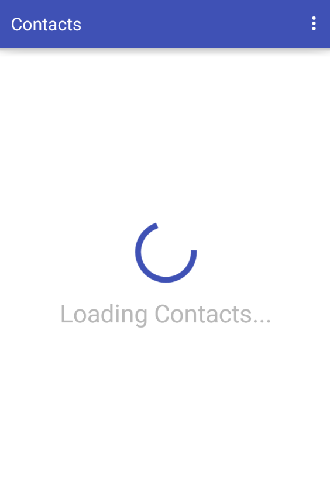
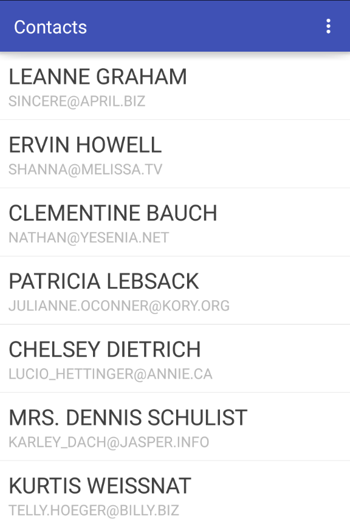
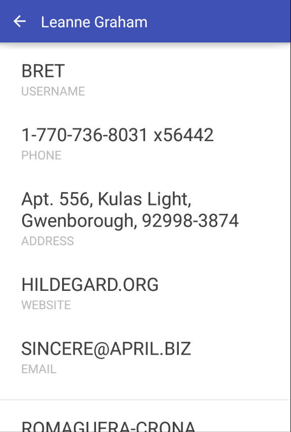

Simple Contact List Android app for OrionHealth
==

## Requirements:

- Support Android 4.0+
- Support portrait and landscape screen orientation
- Use the list of people fetched live from http://jsonplaceholder.typicode.com/users
- Loading animation when fetching the list
- List can be sorted alphabetically (ascending & descending)

External Libs (DEV)
------------

This project use this external libs

* [Retrofit ](http://square.github.io/dagger/)
* [ButterKnife](http://jakewharton.github.io/butterknife/)
* [ReactiveX](https://github.com/ReactiveX/RxJava/)
* [JUnit](http://junit.org/junit4/)
* [Mockito](http://site.mockito.org/)
* [Hamcrest](http://hamcrest.org/JavaHamcrest/)

Screenshots
------------

Developer By
------------

Irineu Licks Filho

* [Facebook](https://www.facebook.com/irineu.licks.filho)
* [LinkedIn](https://www.linkedin.com/in/irineulicks)
